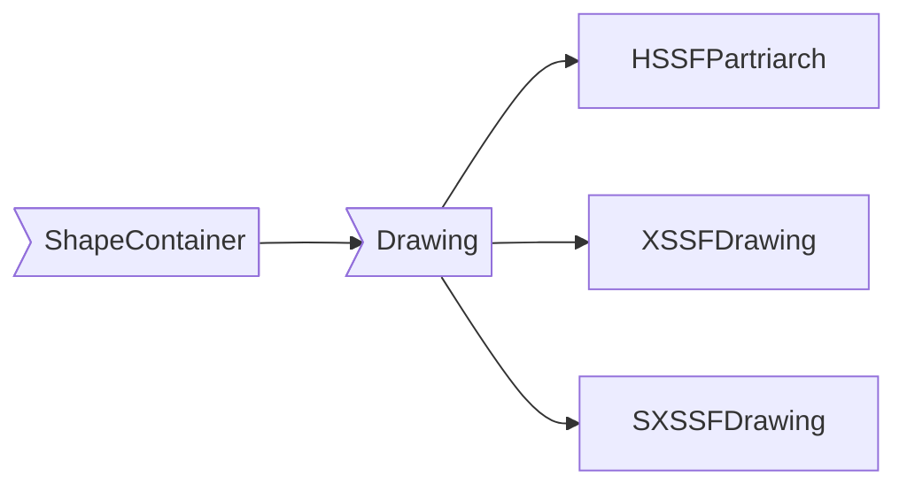
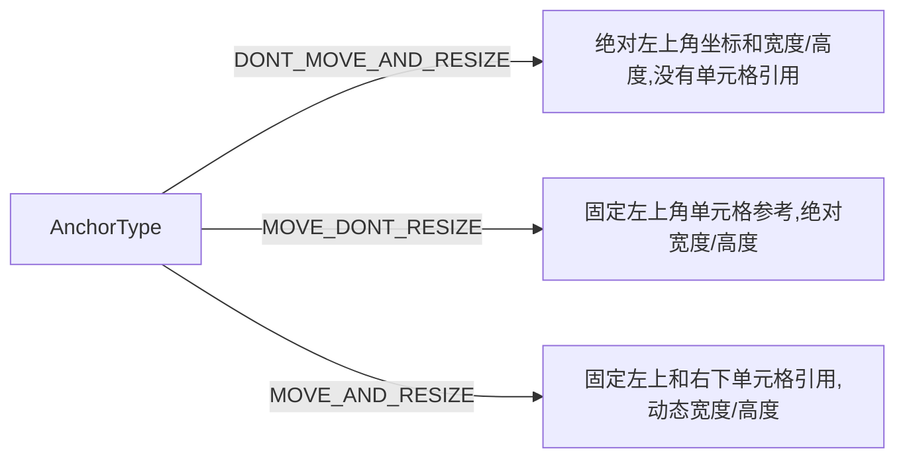
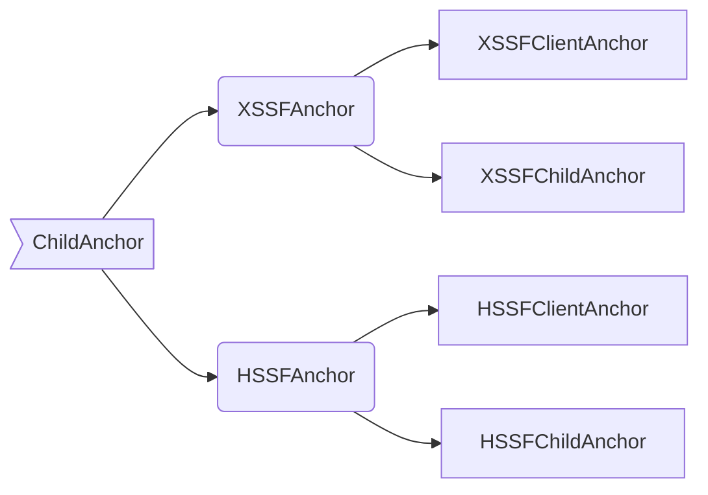

# POI 4.1.0 (Excel Advance)
## 相关简介

### ooxml
<p>
即Open Office Xml，是微软公司为Office2007的技术规范，于2006年12月成为ECMA标准。ooxml-schemas-1.4.jar的技术规范也就是来自ECMA提供的第五版本（2015年12月第三部分，2016年12月第一部分和第四部分）的第四部分中的xsds。
</p>
<p>新的文件格式通过将文档在文件包中进行分段单独的存储，增强了数据恢复的能力。Office Open XML格式使用ZIP和压缩技术来存储文档(即一个office2007文档就是zip包文件)。这种新格式的一个巨大的优势就在于它的文件大小非常小（ 最大的压缩比可以达到原来二进制文件的百分之75）。新的Word 2007，Excel 2007和PowerPoint 2007的文件格式不包含嵌入的可执行代码。Office Open XML格式包含一种特殊用途的格式，它拥有一个单独的扩展名，其中可以包括嵌入的代码，这样就允许IT员工快速的判断文件中是否包含代码。2007 Microsoft Office system是向后兼容的，它可以兼容早期的版本。
</p>

> ECMA 376，目前历经4个版本，第1版（2006年12月）、第2版（2008年12月）、第3版（2011年6月）、第4版（2012年12月）、第五版（2015年12月第三部分，2016年12月第一部分和第四部分）。

### office2007文件包结构
**package**: 顶级文件(docx文件、xlsx文件、pptx文件等)称作为包<br/>
不仅实现了标准zip包，自动提供了文档压缩功能，还提供了Windows平台和非Windows平台的工具程序和API即时读取文档内容的能力。<br/>
**parts**：是包含序列化了的内容的包内组件多数的part是些简单的,根据相关联的XML schema序列化为XML的文本文件.然而,parts还可以在必要的时候被序列化为二进制数据,比如说当一个word文档包含一个图片或者媒体文件的时候。<br/>
**items**：Office Open XML文档格式使用relationships来定义一个源part和一个目标part之间的关系。 package relationship定义一个part与顶级包之间的， part relationship定义一个父part和子part之间的关系。Relationship是独立于具体内容的schema的，所以处理起来就更快，好处是你可以建立一种两个part之间的关系。<br/>
Relationship是定义在一种内部组件relationship item中的，relation item在包中像part一样存储, 出于一致性的考虑, relationship items保存在_rels的文件夹中。

### Open Office XML文件格式
Open XML 采用特定标记语言（即 WordprocessingML、SpreadsheetML 和 PresentationML）的形式，定义字处理文档、电子表格文档和演示文稿文档的格式。对于 Open XML 文件格式而言，标记兼容性是指以上述标记语言之一表示的文档能够促进应用程序之间或一个应用程序的不同版本（具有不同的功能集）之间进行互操作。通过使用 Open XML 规范的标记兼容性命名空间中的一组定义的 XML 元素和属性，可支持这一点。请注意，当文档格式中支持标记时，标记的生成者和使用者（如 Microsoft Word）也必须支持它。换句话说，互操作性是在文件格式和应用程序中均受支持的一项功能。
1. PresentationML 文档<br/>
文档结构由包含 <sldMaster>（幻灯片母版）、<sldLayout>（幻灯片版式）、<sld >（幻灯片）<presentation>（演示文稿）元素和引用演示文稿中的幻灯片的 <theme>（主题）元素组成。 （主题元素是 DrawingMLTheme 部件的根元素。）这些元素是有效的演示文稿文档至少要包含的元素。
2. SpreadsheetML 文档<br/>文档结构由包含 <sheets> 的 <workbook> 元素和在工作簿中引用工作表的<sheet>元素组成。将为每张工作表创建单独的XML文件。这些元素是有效电子表格文档所需的最小元素。此外，电子表格文档可能包含<table>、<chartsheet>、<pivotTableDefinition>或其他与电子表格相关的元素。
3. WordProcessingML 文档<br/>基本文档结构由 \<document> 和\<body> 元素组成，后跟一个或多个块级元素，例如代表 paragraph 的\<p>。paragraph包含一个或多个\<r>元素。<r>代表run，它是具有一组共同属性（如格式设置）的文本区域。run包含一个或多个 \<t> 元素。 \<t> 元素包含文本范围。
<br/>
前部分只是对Office2007文档进行扫盲，此文档仅仅以SpreadsheetML文档相关的Chart部分哈。

### DrawingML - Charts

命名空间chart在DrawingML中用于柱状图、饼状图、散点图或其他类型的图表表示数字数据的可视化。chartSpace元素为整个文档的根节点，OOXML描述文档部分结构如下：
```xml
<?xml version="1.0" encoding="UTF-8" standalone="yes"?>
<c:chartSpace xmlns:c="http://schemas.openxmlformats.org/drawingml/2006/chart" 
    xmlns:a="http://schemas.openxmlformats.org/drawingml/2006/main" 
    xmlns:r="http://schemas.openxmlformats.org/officeDocument/2006/relationships">
    <c:date1904 val="0"/>
    <c:lang val="zh-CN"/>
    <c:roundedCorners val="0"/>
    <mc:AlternateContent xmlns:mc="http://schemas.openxmlformats.org/markup-compatibility/2006">
        <mc:Choice Requires="c14" 
            xmlns:c14="http://schemas.microsoft.com/office/drawing/2007/8/2/chart">
            <c14:style val="102"/>
        </mc:Choice>
        <mc:Fallback>
            <c:style val="2"/>
        </mc:Fallback>
    </mc:AlternateContent>
    <c:chart>
        <!-- chart 区-->
    </c:chart>
    <c:spPr>
    </c:spPr>
    <c:txPr>
    </c:txPr>
    <c:printSettings>
       
    </c:printSettings>
</c:chartSpace>

```
#### 图空间（Chart Space）
此元素指定单个图表的总体设置，并且是图表部分的根节点。元素节点名称为CT_ChartSpace。

| 元素名称 | 全称 |complexType name|  说明 |
| -- | :-: | -- | --|
| chart | Chart | CT_Chart | 声明图表 |
| clrMapOvr | Color Map Override| CT_ColorMapping | 表示颜色映射信息 |
|date1904 | 1904 Date System | CT_Boolean | 兼容指定图表使用1904年日期系统 |
| externalData | External Data Relationship | CT_ExternalData | 此图表与数据的关系 |
| extLst  | Chart Extensibility | CT_ExtensionList | 此元素包含用于文件格式未来可扩展性的标记 |
| lang  | Editing Language | CT_TextLanguageID | 指定上次修改此图表时使用的主要编辑语言 |
| pivotSource  | Pivot Source | CT_PivotSource| 指定一个轴心图的源轴心表 |
| printSettings | Print Settings | CT_PrintSettings | 图表的打印设置 |
| protection  | protection | CT_Protection | 指定图表的保护。如果图表位于受保护的工作表或图表表中，则这些设置将控制用户如何与图表交互。|
| roundedCorners | Rounded Corners | CT_Boolean | 指定图表区域应有圆角 |
| spPr | Shape Properties | CT_ShapeProperties | 指定父图表元素的格式 |
| style | Style | CT_Style | 指定应用于图表的样式 |
|txPr | Text Properties | CT_TextBody | 指定文本格式。不支持lstStyle元素 |
| userShapes | Reference to Chart Drawing Part | CT_RelId | 指定与包含要在图表顶部绘制的绘图的单独部分的关系 |


#### 图表（Chart）
用于chartSpace元素中声明一个图表元素节点，属性id是由父元素指定的关系类型，用于指定指定此图表、图表绘图或VML绘图部分的关系的关系ID，命名空间为http://schemas.openxmlformats.org/officeDocument/2006/relationships。其子元素有：

| 元素名称 | 全称 |complexType name|  说明 |
| -- | :-: | -- | -- |
|autoTitleDeleted |Auto Title Is Deleted|CT_Boolean| 指定此图表不应显示标题 |
|backWall| Back Wall | CT_Surface | 指定图表的后壁 |
| dispBlanksAs | Display Blanks As | CT_DispBlanksAs | 指定如何在图表上绘制空白单元格 |
| extLst | Chart Extensibility | CT_ExtensionList | 用于文件格式未来可扩展性的标记|
| floor  | floor | CT_Surface | 此元素指定三维图表的底层 |
| legend  | legend  | CT_Legend| 声明图例 |
| pivotFmts | Pivot Formats | CT_PivotFmts | 此元素包含从低到高索引的表面图表的格式化带的集合 |
|plotArea | Plot Area | CT_PlotArea | 声明图表的绘图区域 |
| plotVisOnly | Plot Visible Only | CT_Boolean | 指定只应在图表上绘制可见单元格 |
| showDLblsOverMax | Show Data Labels over Maximum | CT_Boolean | 指定应显示图表最大值以上的数据标签  |
| sideWall  |  Side Wall | CT_Surface | 指定侧壁 |
| title  | title | 2CT_Title11| 声明一个标题 |
| view3D | View In 3D | CT_View3D | 图表的三维视图 |


#### 图表绘图区（Plot Area）
在OOXML中节点元素名称为CT_PlotArea，其父节点元素为Chart Space中的chart元素，其子元素有：

| 元素名称 | 全称 |complexType name|  说明 |
| -- | :-: | -- | --|
| area3DChart | 3D Area Charts | CT_Area3DChart | 三维区域系列 |
| areaChart | Area Charts | CT_AreaChart | 二维区域序列 |
| bar3DChart | 3D Bar Charts | CT_Bar3DChart | 此元素包含此图表上的三维条形或列系列|
| barChart | Bar Charts | CT_BarChart | 此元素包含此图表上的二维条形或列系列 |
| bubbleChart | Bubble Charts | CT_BubbleChart |气泡系列|
| catAx | Category Axis Data | CT_CatAx | 指定图表的类别轴 |
| dateAx | Date Axis | CT_DateAx | 指定图表的日期轴 |
| doughnutChart | Doughnut Charts | CT_DoughnutChart | 此元素包含环形图表系列 |
| dTable | Data Table | CT_DTable | 此元素指定一个数据表 |
| extLst | Chart Extensibility | CT_ExtensionList | 此元素包含用于文件格式未来可扩展性的标记 |
| layout | Layout | CT_Layout | 指定chart元素如何放置在图表上 |
| line3DChart | 3D Line Charts| CT_Line3DChar | 此元素包含三维线形图系列 |
| lineChart | Line Charts | CT_LineChart | 此元素包含二维线形图系列 |
| ofPieChart | Pie of Pie or Bar of Pie Charts | CT_OfPieChart |  此元素包含此图表上pie的pie或者pie系列的Bar。只显示第一个系列。splitType 元素将决定是否应用 splitPos 和 custSplit元素。 |
| pie3DChart | 3D Pie Charts | CT_Pie3DChart | 三维饼图系列 |
| pieChart | Pie Charts | CT_PieChart | 二维饼图系列 |
| radarChart | Radar Charts | CT_RadarChart |  雷达图系列 |
| scatterChart | Scatter Charts | CT_ScatterChart | 散点图系列 |
| serAx | Series Axis | CT_SerAx | 指定一个系列轴 |
| spPr | Shape Properties | CT_ShapeProperties | 指定父图表元素的格式 |
| stockChart | Stock Charts | CT_StockChart | 股票图表系列 |
| surface3DChart | 3D Surface Charts | CT_Surface3DChart | 三维曲面系列 |
| surfaceChart | Surface Charts |  CT_SurfaceChart | 二维等高线图 |
| valAx | Value Axis | CT_ValAx | 此元素指定值轴 |

#### 2D区域图（Area Charts）
在OOXML文档中节点元素名称为CT_AreaChart，其父节点元素为plotArea，其子元素有7个：
|子元素| 全名称| 说明 |
| -- | :-: | -- |
| axId | Axis ID | 指定定义图表坐标空间的轴的标识符 |
| dLbls | Data Labels | 指定整个系列或整个图表的数据标签的设置 |
| dropLines | Drop Lines | 此元素指定删除行 |
| extLst | Chart Extensibility| 包含用于文件格式未来可扩展性的标记 |
| grouping | Grouping | 此元素指定列、线或区域图表的分组类型 |
| ser | Area Chart Series | 在区域图上指定一个系列 |
| varyColors | Vary Colors by Point | 指定系列中的每个数据标记应有不同的颜色|
在OOXML定义内容实例：
```xml
<complexType name="CT_AreaChart">
	<sequence>
	<group ref="EG_AreaChartShared" minOccurs="1" maxOccurs="1"/>
	<element name="axId" type="CT_UnsignedInt" minOccurs="2" maxOccurs="2"/>
	<element name="extLst" type="CT_ExtensionList" minOccurs="0" maxOccurs="1"/>
	</sequence>
</complexType>
```


## poi使用ooxml操作Excel文档
### maven依赖
```xml
        <dependency>
            <groupId>org.apache.poi</groupId>
            <artifactId>poi</artifactId>
            <version>4.1.0</version>
        </dependency>

        <dependency>
            <groupId>org.apache.poi</groupId>
            <artifactId>ooxml-schemas</artifactId>
            <version>1.4</version>
        </dependency>

        <dependency>
            <groupId>org.apache.poi</groupId>
            <artifactId>poi-ooxml</artifactId>
            <version>4.1.0</version>
        </dependency>
```
### 画布种类
POI中总共有三种画布，全部继承于Drawing接口，顶级接口为指定了特定类型Shape接口的ShapeContainer容器接口：



### 创建画布

```java
    //SXSSFSheet
    //创建SpreadsheetML顶级画布，如果当前工作表已经存在，则返回已存在的画布
    /**
     * Creates the top-level drawing patriarch.
     *
     * @return  The new drawing patriarch.
     */
    @Override
    public SXSSFDrawing createDrawingPatriarch()
    {
        return new SXSSFDrawing(getWorkbook(), _sh.createDrawingPatriarch());
    }
```


### 获取画布
```java
    //SXSSFSheet
    //获取画布，如果存在，则返回已经存在的画布，否则返回为null
    @Override
    public XSSFDrawing getDrawingPatriarch()
    {
        return _sh.getDrawingPatriarch();
    }
```


### 锚点
锚点(client anchor)依附于excel的工作表中。
#### 锚点可参照为：
- 具有固定的位置和固定的大小尺寸
- 相对于单元格的位置(左上角)和固定大小
- 相对于单元格的位置(左上角)和相对于另一个单元格的大小(右下角)

#### 锚点位置描述AnchorType类型也分为三种：

> 注：此类只是描述和计算当前单元格的位置，如果工作表的行距或列宽进行变动，则需要重新计算更新。默认为MOVE_AND_RESIZE类型。

#### 锚点类
锚点主要有两大类，实现了ChildAnchor接口，ChildAnchor主要规定了每个锚点类的位置坐标等。

XSSFClientAnchor(int dx1, int dy1, int dx2, int dy2, int col1, int row1, int col2, int row2)参数：
* dx1是第一个单元格中的x坐标。
* dy1第一个单元格中的y坐标。
* dx2第二个单元格中的x坐标。
* dy2第二个单元格中的y坐标。
* col1第一个单元格的列(0)。
* row1第一个单元格的行(0)。
* col2第二个单元格的列(0)。
* row2第二个单元格的行(0)。

> 默认的锚点位置坐标全部是0。
> 
### chart类
SpreadsheetML Chart只有XSSFChart类，继承于XDDFChart，实现了Chart接口。其创建源码如下：

```java
    public XSSFChart createChart(XSSFClientAnchor anchor) {
        int chartNumber = getPackagePart().getPackage().getPartsByContentType(XSSFRelation.CHART.getContentType())
            .size() + 1;

        RelationPart rp = createRelationship(XSSFRelation.CHART, XSSFFactory.getInstance(), chartNumber, false);
        XSSFChart chart = rp.getDocumentPart();
        String chartRelId = rp.getRelationship().getId();

        XSSFGraphicFrame frame = createGraphicFrame(anchor);
        frame.setChart(chart, chartRelId);
        frame.getCTGraphicalObjectFrame().setXfrm(createXfrm(anchor));

        return chart;
    }
    
```
> **注：** Chart接口可能在未来的4.2.0版本中会被废弃掉。


#### 创建chart和绘图区
```java
    XSSFChart chart = drawing.createChart(anchor);
    CTChart ctChart = ((XSSFChart)chart).getCTChart();
    CTPlotArea ctPlotArea = ctChart.getPlotArea();
```

### 图注
```java
 CTLegend ctLegend = ctChart.addNewLegend();
 ctLegend.addNewLegendPos().setVal(STLegendPos.L);
 //与其他图标元素不能重叠
 ctLegend.addNewOverlay().setVal(false);
```
- 图注的位置：
```java
    static final Enum B = Enum.forString("b"); //底部
    static final Enum TR = Enum.forString("tr"); //右上角
    static final Enum L = Enum.forString("l"); //左边
    static final Enum R = Enum.forString("r"); //右边
    static final Enum T = Enum.forString("t"); //顶部
```
> 注：在OOXML文档中默认值为r,但是在java这边默认值好像是B

### 图标题
```java
SXSSFDrawing drawingPatriarch = sheet.createDrawingPatriarch();
XSSFDrawing drawing =sheet.getDrawingPatriarch();
XSSFChart chart = drawing.createChart(anchor);
chart.setTitleText("这个是图标题");
```

### 柱状图（Bar Charts）
在ooxml中元素名称为barChart, 父元素为plotArea，子元素有：
| 元素名称 | 全称 |complexType name|  说明 |
| -- | :-: | -- | --|
| axId | Axis ID |CT_UnsignedInt | 指定轴的标识符 |
| barDir | Bar Direction | CT_BarDir |  指定该系列是形成条形(水平)图还是列(垂直)图 |
| dLbls  | Data Labels | CT_DLbls | 图表的数据标签的设置  |
| extLst | Chart Extensibility | CT_ExtensionList | 包含用于文件格式未来可扩展性的标记 |
| gapWidth | Gap Width | CT_GapAmount | 指定每个Bar之间空间宽度的百分比 |
| grouping | Bar Grouping | CT_BarGrouping | 分组类型 |
| overlap  | Overlap | CT_Overlap | 指定在二维图表上应重叠多少条和列 |
| ser | Bar Chart Series | CT_BarSer | 指定柱状图上的序列 |
| serLines | Series Lines | CT_ChartLines | 指定图表的系列行 |
| varyColors | Vary Colors by Point | CT_Boolean | 指定系列中的每个数据标记的不同的颜色 |

ooxml中的定义内容大致如下：
```xml
<complexType name="CT_BarChart">
	<sequence>
	<group ref="EG_BarChartShared" minOccurs="1" maxOccurs="1"/>
	<element name="gapWidth" type="CT_GapAmount" minOccurs="0" maxOccurs="1"/>
	<element name="overlap" type="CT_Overlap" minOccurs="0" maxOccurs="1"/>
	<element name="serLines" type="CT_ChartLines" minOccurs="0" maxOccurs="unbounded"/>
	<element name="axId" type="CT_UnsignedInt" minOccurs="2" maxOccurs="2"/>
	<element name="extLst" type="CT_ExtensionList" minOccurs="0" maxOccurs="1"/>
	</sequence>
</complexType>
```

```java
   //绘制流程，相当于给xml文档添加节点和属性

    
    //1. 创建和获取 SpreadsheetML drawing 节点 --> CTDrawing
    SXSSFDrawing drawingPatriarch = sheet.createDrawingPatriarch();
    XSSFDrawing drawing =sheet.getDrawingPatriarch();
    ClientAnchor anchor = anchor=drawing.createAnchor(0, 0, 0, 0, 
    0, curRow+dataList.size()+1, 6, curRow+dataList.size()+12);
    //2. 给CTDrawing添加SpreadsheetML Chart节点 --> CTChart
    XSSFChart chart = drawing.createChart(anchor);
    CTChart ctChart = ((XSSFChart)chart).getCTChart();
    //3. 给CTChart添加 CTPlotArea 节点
    CTPlotArea ctPlotArea = ctChart.getPlotArea();
    //4. 给CTPlotArea添加CTBarChart节点
    CTBarChart ctBarChart = ctPlotArea.addNewBarChart();
    CTBoolean ctBoolean=ctBarChart.addNewVaryColors();
    ctBarChart.getVaryColors().setVal(true);
    //设置类型
    ctBarChart.addNewGrouping().setVal(group);
    ctBoolean.setVal(true);
    ctBarChart.addNewBarDir().setVal(STBarDir.COL);
     //CTChart元素的设置：

    //1. 添加addNewDispBlanksAs
    //2. 添加addNewShowDLblsOverMax
    //3. 其他子元素
    ctChart.addNewDispBlanksAs().setVal(STDispBlanksAs.SPAN);
    ctChart.addNewShowDLblsOverMax().setVal(false);
    //以上柱状图根元素创建完成，然后就是对CTBarChart子元素的添加和设置：


    /**设置CTBarChart中的统计数据：

    1. 添加CT_BarSer元素
    2. 给CT_BarSer添加addNewTx文本元素
    3. 给CT_BarSer添加addNewIdx序列id引用元素
    4. ctBarSer添加分组类别
    5. 添加数组值addNewVal
    6. 创建标签CTDLbls元素
    */
    for (int i = 0; i < fldNameArr.size()-1; i++) {
        CTBarSer ctBarSer = ctBarChart.addNewSer();
        CTSerTx ctSerTx = ctBarSer.addNewTx();
        //图例区
        CTStrRef ctStrRef = ctSerTx.addNewStrRef();
        String legendDataRange = new CellRangeAddress(curRow,curRow, i+1, i+1).formatAsString(sheetName, true);
        ctStrRef.setF(legendDataRange);
        ctBarSer.addNewIdx().setVal(i);

        //横坐标区
        CTAxDataSource cttAxDataSource = ctBarSer.addNewCat();
        ctStrRef = cttAxDataSource.addNewStrRef();
        String axisDataRange = new CellRangeAddress(curRow+1, curRow+dataList.size(), 0, 0)
                .formatAsString(sheetName, true);
        ctStrRef.setF(axisDataRange);

        //数据区域
        CTNumDataSource ctNumDataSource = ctBarSer.addNewVal();
        CTNumRef ctNumRef = ctNumDataSource.addNewNumRef();
        String numDataRange = new CellRangeAddress(curRow+1, curRow+dataList.size(), i+1, i+1)
                .formatAsString(sheetName, true);
        ctNumRef.setF(numDataRange);

        ctBarSer.addNewSpPr().addNewLn().addNewSolidFill().addNewSrgbClr().setVal(new byte[] {0,0,0});

        //设置负轴颜色不是白色
        ctBarSer.addNewInvertIfNegative().setVal(false);
        //设置标签格式
        ctBoolean.setVal(false);
        CTDLbls newDLbls = ctBarSer.addNewDLbls();
        newDLbls.setShowLegendKey(ctBoolean);
        ctBoolean.setVal(true);
        newDLbls.setShowVal(ctBoolean);
        ctBoolean.setVal(false);
        newDLbls.setShowCatName(ctBoolean);
        newDLbls.setShowSerName(ctBoolean);
        newDLbls.setShowPercent(ctBoolean);
        newDLbls.setShowBubbleSize(ctBoolean);
        newDLbls.setShowLeaderLines(ctBoolean);
    }
    
    ctBarChart.addNewAxId().setVal(123456);
    ctBarChart.addNewAxId().setVal(123457);
   

    

    //x轴
    CTCatAx ctCatAx = ctPlotArea.addNewCatAx();
    ctCatAx.addNewAxId().setVal(123456); //id of the cat axis
    CTScaling ctScaling = ctCatAx.addNewScaling();
    ctScaling.addNewOrientation().setVal(STOrientation.MIN_MAX);
    ctCatAx.addNewAxPos().setVal(STAxPos.B);
    ctCatAx.addNewCrossAx().setVal(123457); //id of the val axis
    ctCatAx.addNewTickLblPos().setVal(STTickLblPos.NEXT_TO);

    //y轴
    CTValAx ctValAx = ctPlotArea.addNewValAx();
    ctValAx.addNewAxId().setVal(123457); //id of the val axis
    ctScaling = ctValAx.addNewScaling();
    ctScaling.addNewOrientation().setVal(STOrientation.MIN_MAX);
    //设置位置
    ctValAx.addNewAxPos().setVal(STAxPos.L);
    ctValAx.addNewCrossAx().setVal(123456); //id of the cat axis
    ctValAx.addNewTickLblPos().setVal(STTickLblPos.NEXT_TO);
    //图注
    CTLegend ctLegend = ctChart.addNewLegend();
    ctLegend.addNewLegendPos().setVal(STLegendPos.TR);
    ctLegend.addNewOverlay().setVal(false);
```