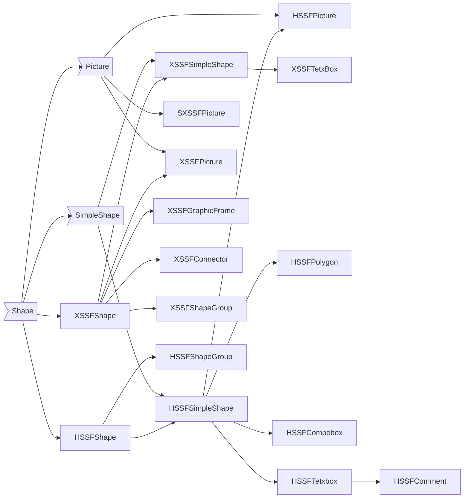
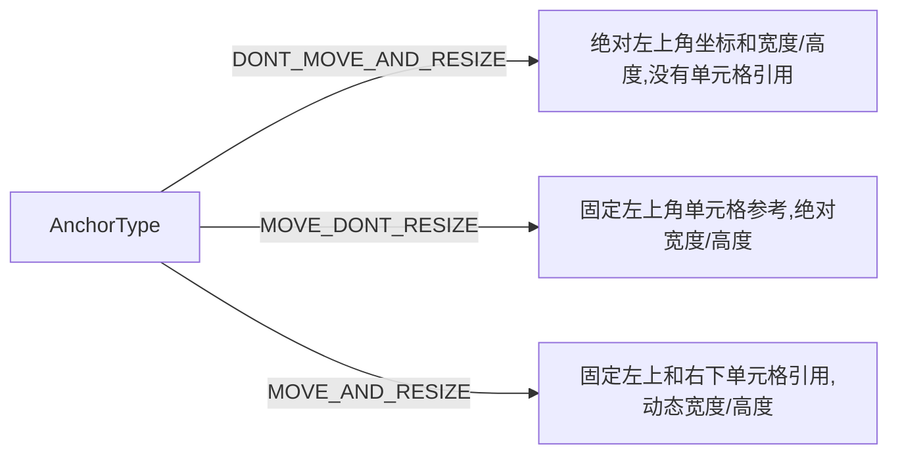

# POI 4.1.0 (Excel Advance)
## Excel

### ooxml
<p>
即Open Office Xml，是微软公司为Office2007的技术规范，于2006年12月成为ECMA标准。ooxml-schemas-1.4.jar的技术规范也就是来自ECMA提供的第五版本（2015年12月第三部分，2016年12月第一部分和第四部分）的第四部分中的xsds。
</p>
<p>新的文件格式通过将文档在文件包中进行分段单独的存储，增强了数据恢复的能力。Office Open XML格式使用ZIP和压缩技术来存储文档(即一个office2007文档就是zip包文件)。这种新格式的一个巨大的优势就在于它的文件大小非常小（ 最大的压缩比可以达到原来二进制文件的百分之75）。新的Word 2007，Excel 2007和PowerPoint 2007的文件格式不包含嵌入的可执行代码。Office Open XML格式包含一种特殊用途的格式，它拥有一个单独的扩展名，其中可以包括嵌入的代码，这样就允许IT员工快速的判断文件中是否包含代码。2007 Microsoft Office system是向后兼容的，它可以兼容早期的版本。
</p>

> ECMA 376，目前历经4个版本，第1版（2006年12月）、第2版（2008年12月）、第3版（2011年6月）、第4版（2012年12月）、第五版（2015年12月第三部分，2016年12月第一部分和第四部分）。

### office2007文件包结构
**package**: 顶级文件(docx文件、xlsx文件、pptx文件等)称作为包<br/>
不仅实现了标准zip包，自动提供了文档压缩功能，还提供了Windows平台和非Windows平台的工具程序和API即时读取文档内容的能力。<br/>
**parts**：是包含序列化了的内容的包内组件多数的part是些简单的,根据相关联的XML schema序列化为XML的文本文件.然而,parts还可以在必要的时候被序列化为二进制数据,比如说当一个word文档包含一个图片或者媒体文件的时候。<br/>
**items**：Office Open XML文档格式使用relationships来定义一个源part和一个目标part之间的关系。 package relationship定义一个part与顶级包之间的， part relationship定义一个父part和子part之间的关系。Relationship是独立于具体内容的schema的，所以处理起来就更快，好处是你可以建立一种两个part之间的关系。<br/>
Relationship是定义在一种内部组件relationship item中的，relation item在包中像part一样存储, 出于一致性的考虑, relationship items保存在_rels的文件夹中。

### Office Open XML文件格式
Open XML 采用特定标记语言（即 WordprocessingML、SpreadsheetML 和 PresentationML）的形式，定义字处理文档、电子表格文档和演示文稿文档的格式。对于 Open XML 文件格式而言，标记兼容性是指以上述标记语言之一表示的文档能够促进应用程序之间或一个应用程序的不同版本（具有不同的功能集）之间进行互操作。通过使用 Open XML 规范的标记兼容性命名空间中的一组定义的 XML 元素和属性，可支持这一点。请注意，当文档格式中支持标记时，标记的生成者和使用者（如 Microsoft Word）也必须支持它。换句话说，互操作性是在文件格式和应用程序中均受支持的一项功能。
1. PresentationML 文档<br/>
文档结构由包含 <sldMaster>（幻灯片母版）、<sldLayout>（幻灯片版式）、<sld >（幻灯片）<presentation>（演示文稿）元素和引用演示文稿中的幻灯片的 <theme>（主题）元素组成。 （主题元素是 DrawingMLTheme 部件的根元素。）这些元素是有效的演示文稿文档至少要包含的元素。
2. SpreadsheetML 文档<br/>文档结构由包含 <sheets> 的 <workbook> 元素和在工作簿中引用工作表的<sheet>元素组成。将为每张工作表创建单独的XML文件。这些元素是有效电子表格文档所需的最小元素。此外，电子表格文档可能包含<table>、<chartsheet>、<pivotTableDefinition>或其他与电子表格相关的元素。
3. WordProcessingML 文档<br/>基本文档结构由 \<document> 和\<body> 元素组成，后跟一个或多个块级元素，例如代表 paragraph 的\<p>。paragraph包含一个或多个\<r>元素。<r>代表run，它是具有一组共同属性（如格式设置）的文本区域。run包含一个或多个 \<t> 元素。 \<t> 元素包含文本范围。
<br/>
前部分只是对Office2007文档进行扫盲，此文档仅仅以SpreadsheetML文档相关哈。
### poi配合ooxml操作Excel文档
#### maven依赖
```xml
        <dependency>
            <groupId>org.apache.poi</groupId>
            <artifactId>poi</artifactId>
            <version>4.1.0</version>
        </dependency>

        <dependency>
            <groupId>org.apache.poi</groupId>
            <artifactId>ooxml-schemas</artifactId>
            <version>1.4</version>
        </dependency>

        <dependency>
            <groupId>org.apache.poi</groupId>
            <artifactId>poi-ooxml</artifactId>
            <version>4.1.0</version>
        </dependency>
```
#### Excel统计图绘制
##### 画布种类
POI中总共有三种画布，全部继承于Drawing接口，顶级接口为指定了特定类型Shape接口的ShapeContainer容器接口：


##### 图形继承关系图
just eww!

##### 创建画布

```java
    //SXSSFSheet
    //创建SpreadsheetML顶级画布，如果当前工作表已经存在，则返回已存在的画布
    /**
     * Creates the top-level drawing patriarch.
     *
     * @return  The new drawing patriarch.
     */
    @Override
    public SXSSFDrawing createDrawingPatriarch()
    {
        return new SXSSFDrawing(getWorkbook(), _sh.createDrawingPatriarch());
    }
```

##### 获取画布
```java
    //SXSSFSheet
    //获取画布，如果存在，则返回已经存在的画布，否则返回为null
    @Override
    public XSSFDrawing getDrawingPatriarch()
    {
        return _sh.getDrawingPatriarch();
    }
```

##### 锚点位置
客户端锚点(client anchor)依附于excel的工作表中。
###### 锚点可参照为：
- 具有固定的位置和固定的大小尺寸
- 相对于单元格的位置(左上角)和固定大小
- 相对于单元格的位置(左上角)和相对于另一个单元格的大小(右下角)

###### 锚点位置描述AnchorType类型也分为三种：

> 注：此类只是描述和计算当前单元格的位置，如果工作表的行距或列宽进行变动，则需要重新计算更新。默认为MOVE_AND_RESIZE类型。

###### 锚点类
锚点主要有两大类，实现了ChildAnchor接口，ChildAnchor主要规定了每个锚点类的位置坐标等。

XSSFClientAnchor(int dx1, int dy1, int dx2, int dy2, int col1, int row1, int col2, int row2)参数：
* dx1是第一个单元格中的x坐标。
* dy1第一个单元格中的y坐标。
* dx2第二个单元格中的x坐标。
* dy2第二个单元格中的y坐标。
* col1第一个单元格的列(0)。
* row1第一个单元格的行(0)。
* col2第二个单元格的列(0)。
* row2第二个单元格的行(0)。

> 默认的锚点位置坐标全部是0。

##### chart类
SpreadsheetML Chart只有XSSFChart类，继承于XDDFChart，实现了Chart接口。其创建源码如下：

```java
    public XSSFChart createChart(XSSFClientAnchor anchor) {
        int chartNumber = getPackagePart().getPackage().getPartsByContentType(XSSFRelation.CHART.getContentType())
            .size() + 1;

        RelationPart rp = createRelationship(XSSFRelation.CHART, XSSFFactory.getInstance(), chartNumber, false);
        XSSFChart chart = rp.getDocumentPart();
        String chartRelId = rp.getRelationship().getId();

        XSSFGraphicFrame frame = createGraphicFrame(anchor);
        frame.setChart(chart, chartRelId);
        frame.getCTGraphicalObjectFrame().setXfrm(createXfrm(anchor));

        return chart;
    }
    
```

##### 创建chart和绘图设置
```java

    XSSFChart chart = drawing.createChart(anchor);
    CTChart ctChart = ((XSSFChart)chart).getCTChart();
    CTPlotArea ctPlotArea = ctChart.getPlotArea();
    //追加并返回一个新的空值(作为xml)作为最后一个“barChart”元素
    CTBarChart ctBarChart = ctPlotArea.addNewBarChart();
    //创建一个空的颜色变量元素
    CTBoolean ctBoolean=ctBarChart.addNewVaryColors();
    ctBarChart.getVaryColors().setVal(true);
    
    //设置类型
    ctBarChart.addNewGrouping().setVal(group);
    ctBoolean.setVal(true);
    ctBarChart.addNewBarDir().setVal(STBarDir.COL);
    
    //是否添加左侧坐标轴
    ctChart.addNewDispBlanksAs().setVal(STDispBlanksAs.ZERO);
    ctChart.addNewShowDLblsOverMax().setVal(true);
    
    //按照分组设置为堆积模式
    ctBarChart.addNewGapWidth().setVal(150);
    ctBarChart.addNewOverlap().setVal((byte)100);
    
```
> 注：Chart接口可能在未来的4.2.0版本中会被废弃掉。

##### 绘图内容
* 设置图例
```java
    //图例区
    CTStrRef ctStrRef = ctSerTx.addNewStrRef();
    String legendDataRange = new CellRangeAddress(curRow,curRow, i+1, i+1).formatAsString(sheetName, true);
    ctStrRef.setF(legendDataRange);
    ctBarSer.addNewIdx().setVal(i);
    
    //设置x轴信息
    CTSerTx ctSerTx = ctBarSer.addNewTx();
    //添加分类序列
    ctBarSer.addNewIdx().setVal(i);
    CTAxDataSource cttAxDataSource = ctBarSer.addNewCat();
    //设置更坐标内容
    ctStrRef = cttAxDataSource.addNewStrRef();
    String axisDataRange = new CellRangeAddress(curRow+1, curRow+dataList.size(), 0, 0)
            .formatAsString(sheetName, true);
    ctStrRef.setF(axisDataRange);
    //设置负轴颜色不是白色
    ctBarSer.addNewInvertIfNegative().setVal(false);
    
    //数据区域
    CTNumDataSource ctNumDataSource = ctBarSer.addNewVal();
    CTNumRef ctNumRef = ctNumDataSource.addNewNumRef();
    String numDataRange = new CellRangeAddress(curRow+1, curRow+dataList.size(), i+1, i+1)
            .formatAsString(sheetName, true);
    ctNumRef.setF(numDataRange);
    
    ctBarSer.addNewSpPr().addNewLn().addNewSolidFill().addNewSrgbClr().setVal(new byte[] {0,0,0});
    
    //设置标签格式
    ctBoolean.setVal(false);
    CTDLbls newDLbls = ctBarSer.addNewDLbls();
    newDLbls.setShowLegendKey(ctBoolean);
    ctBoolean.setVal(true);
    newDLbls.setShowVal(ctBoolean);
    ctBoolean.setVal(false);
    newDLbls.setShowCatName(ctBoolean);
    newDLbls.setShowSerName(ctBoolean);
    newDLbls.setShowPercent(ctBoolean);
    newDLbls.setShowBubbleSize(ctBoolean);
    newDLbls.setShowLeaderLines(ctBoolean);
    
    //设置y轴
    CTValAx ctValAx = ctPlotArea.addNewValAx();
    ctValAx.addNewAxId().setVal(123457); //id of the val axis
    ctScaling = ctValAx.addNewScaling();
    ctScaling.addNewOrientation().setVal(STOrientation.MIN_MAX);
    //设置位置
    ctValAx.addNewAxPos().setVal(STAxPos.L);
    ctValAx.addNewCrossAx().setVal(123456); //id of the cat axis
    ctValAx.addNewTickLblPos().setVal(STTickLblPos.NEXT_TO);
    
    //是否删除横坐标
    //ctCatAx.addNewDelete().setVal(false);
    //是否删除纵坐标
    //ctValAx.addNewDelete().setVal(false);
    
    //设置图注
    CTLegend ctLegend = ctChart.addNewLegend();
    ctLegend.addNewLegendPos().setVal(STLegendPos.B);
    ctLegend.addNewOverlay().setVal(false);
```

##### X轴
###### X轴标签
###### X轴内容
##### Y轴
##### 图注
##### 图标题

#### 柱状图
#### 圆饼图
#### 散点图
#### 折线图
