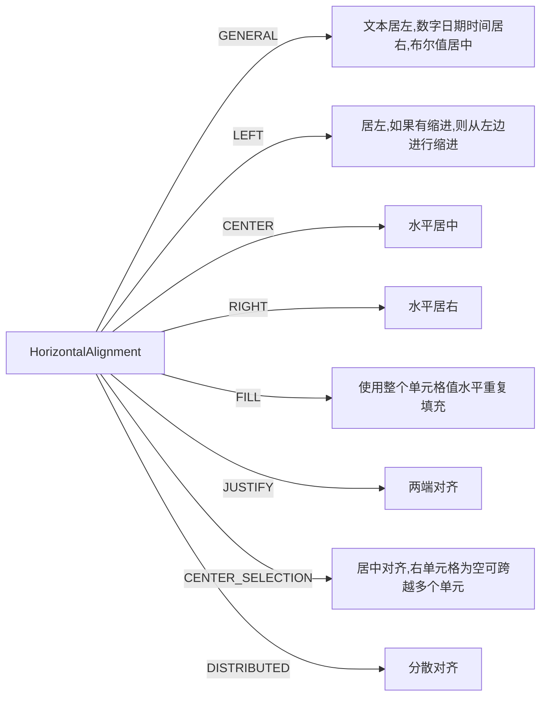
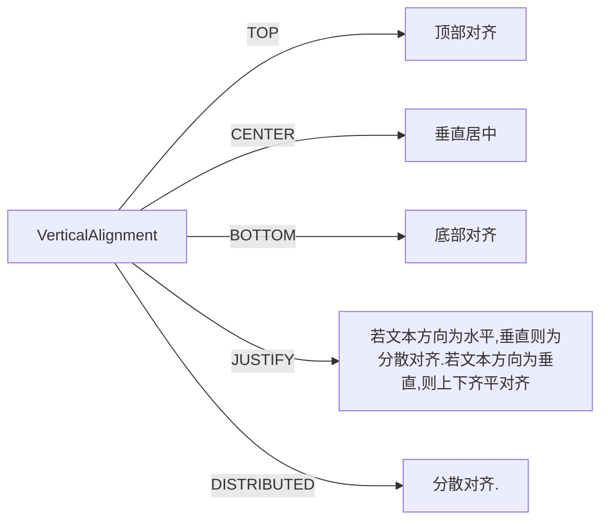
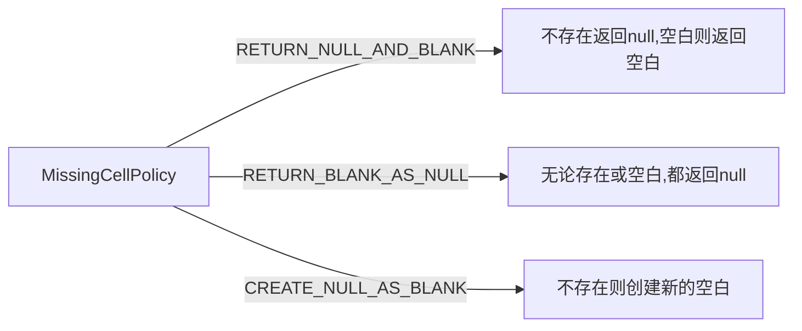
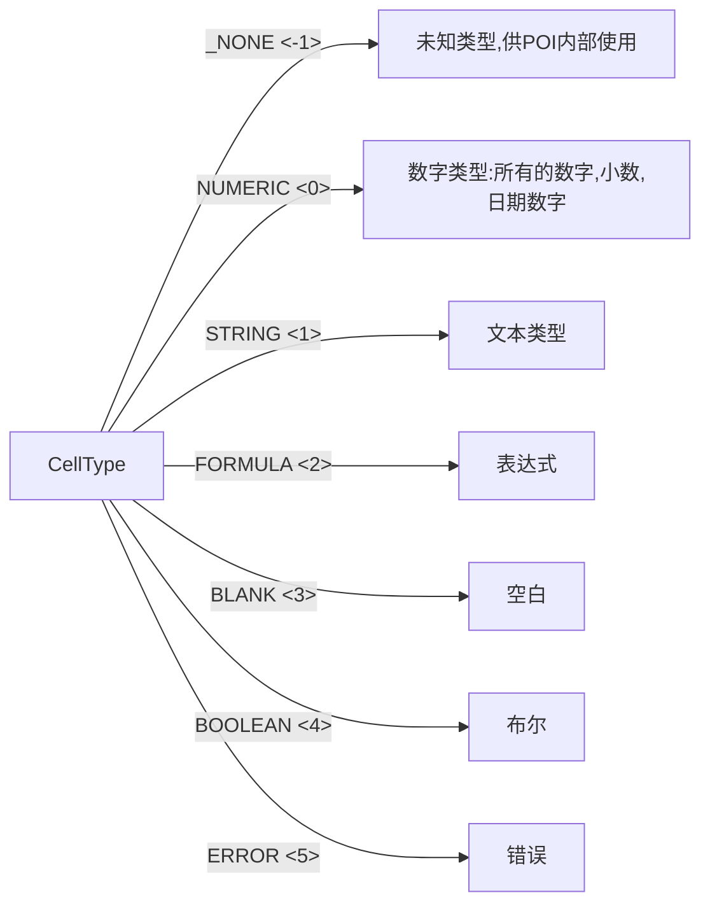
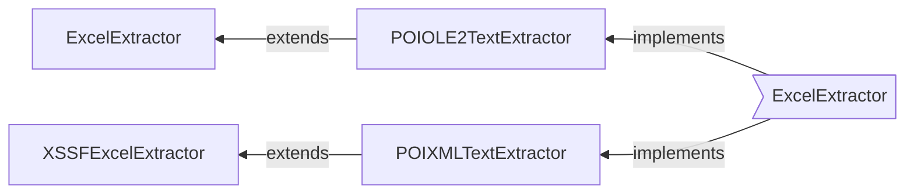
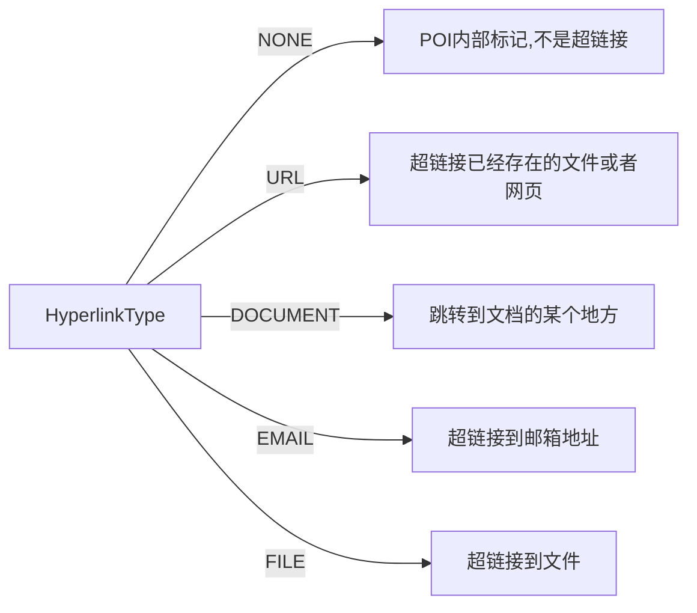
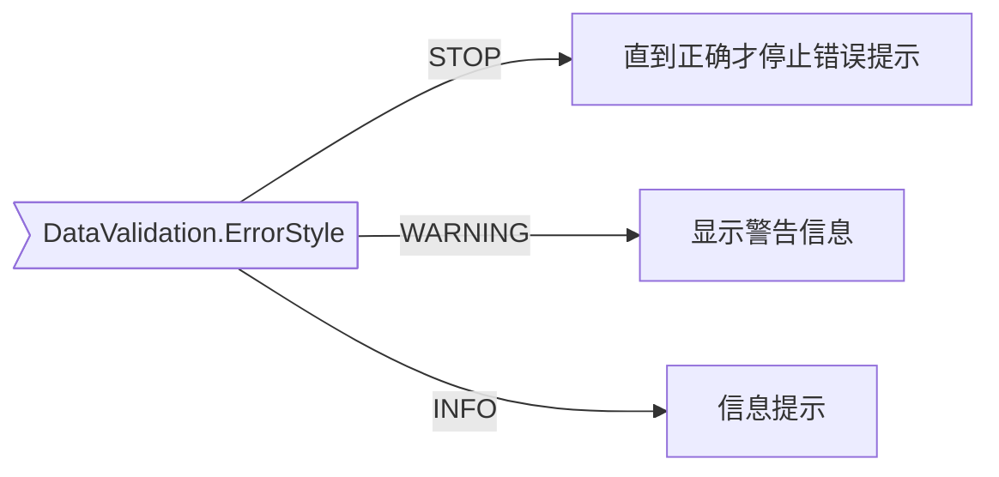

# Apache POI  4.1.0（BASIC）
## Excel
### .xls与.xlsx的区别
<table> 
  <tr>
    <th>xls </th>
    <th>  xlsx</th>
  </tr>
  <tr>
  	<td>97-2003版本</td>
  	<td>2007之后版本</td>
  </tr>
  <tr>
  	<td>xls是一种特有的二进制格式，其核心结构是复合文档类型的结构</td>
  	<td>其核心结构是xml类型的结构、基于xml压缩方式</td>
  </tr>
  <tr>
  	<td>只能打开xls格式，无法打开xlsx格式</td>
  	<td>可以直接打开xls、xlsx格式</td>
  </tr>
  <tr>
  	<td>只有65536行、256列</td>
  	<td>可以有1048576行、16384列</td>
  </tr>
  <tr>
  	<td>占用空间大</td>
  	<td>文件更节约空间、运行速度也比较快一点</td>
  </tr>
</table>

> 具体信息可见SpreadsheetVersion源码:

```java
 /**
     * Excel97 format aka BIFF8
     * <ul>
     * <li>The total number of available rows is 64k (2^16)</li>
     * <li>The total number of available columns is 256 (2^8)</li>
     * <li>The maximum number of arguments to a function is 30</li>
     * <li>Number of conditional format conditions on a cell is 3</li>
     * <li>Number of cell styles is 4000</li>
     * <li>Length of text cell contents is 32767</li>
     * </ul>
     */
    EXCEL97(0x10000, 0x0100, 30, 3, 4000, 32767),

    /**
     * Excel2007
     *
     * <ul>
     * <li>The total number of available rows is 1M (2^20)</li>
     * <li>The total number of available columns is 16K (2^14)</li>
     * <li>The maximum number of arguments to a function is 255</li>
     * <li>Number of conditional format conditions on a cell is unlimited
     * (actually limited by available memory in Excel)</li>
     * <li>Number of cell styles is 64000</li>
     * <li>Length of text cell contents is 32767</li>
     * <ul>
     */
    EXCEL2007(0x100000, 0x4000, 255, Integer.MAX_VALUE, 64000, 32767);
```

### HSSF、XSSF和SXSSF区别
1. HSSF是POI工程对Excel 97(-2003)文件操作的纯Java实现
2. XSSF是POI工程对Excel 2007 OOXML (.xlsx)文件操作的纯Java实现
3. SXSSF是POI 3.8版本开始，提供了一种基于XSSF的低内存占用的API
4. SXSSF通过一个滑动窗口来限制访问Row的数量从而达到低内存占用的目录，XSSF可以访问所有行。旧的行数据不再出现在滑动窗口中并变得无法访问，与此同时写到磁盘上。
在自动刷新的模式下，可以指定窗口中访问Row的数量，从而在内存中保持一定数量的Row。当达到这一数量时，在窗口中产生新的Row数据，并将低索引的数据从窗口中移动到磁盘中。
或者，滑动窗口的行数可以设定成自动增长的。它可以根据需要周期的根据一次明确的flushRow(int keepRows)调用来进行修改。针对 SXSSF Beta 3.8下，会有临时文件产生。

### maven依赖
```xml
        <dependency>
			<groupId>org.apache.poi</groupId>
			<artifactId>poi</artifactId>
			<version>4.1.0</version>
		</dependency>

		<dependency>
			<groupId>org.apache.poi</groupId>
			<artifactId>poi-ooxml</artifactId>
			<version>4.1.0</version>
		</dependency>
```
### API示例
#### 创建Excel
```java
    /**
     * 创建Excel文件，使用XSSFWorkbook和SXSSFWorkbook创建时，必须要创建sheet表单，否则无法打开，显示文件已经损坏
     * @throws IOException
     */
    public static void createWorkbook() throws IOException {
        //Workbook wb =new HSSFWorkbook();
        XSSFWorkbook wb = new XSSFWorkbook();
        //SXSSFWorkbook wb = new SXSSFWorkbook(1);
        //超过部分会被自动扔掉
        Sheet sheet1 = wb.createSheet("sheetname不能超过31个字符");
        try(OutputStream os = new FileOutputStream("workbook.xlsx")) {
            wb.write(os);
        }
    }
```
 在创建sheet时sheetname不能有特殊字符 : \ ? * [ ] /
在创建sheetname时可以通过使用 **String safeName** = **WorkbookUtil.createSafeSheetName**(**sheetname**)进行过滤。其源码：
```java
public static String createSafeSheetName(String nameProposal, char replaceChar) {
        if (nameProposal == null) {
            return "null";
        } else if (nameProposal.length() < 1) {
            return "empty";
        } else {
            int length = Math.min(31, nameProposal.length());
            String shortenname = nameProposal.substring(0, length);
            StringBuilder result = new StringBuilder(shortenname);

            for(int i = 0; i < length; ++i) {
                char ch = result.charAt(i);
                switch(ch) {
                case '\u0000':
                case '\u0003':
                case '*':
                case '/':
                case ':':
                case '?':
                case '[':
                case '\\':
                case ']':
                    result.setCharAt(i, replaceChar);
                    break;
                case '\'':
                    if (i == 0 || i == length - 1) {
                        result.setCharAt(i, replaceChar);
                    }
                }
            }

            return result.toString();
        }
```

#### 创建单元格
* 创建普通单元格
```java
 /**
     * 创建单元格和设置值
     * @param wb
     * @return
     */
    public static Workbook createCell(Workbook wb){
        Sheet sheet = wb.getSheet("sheetname");
        Row row = sheet.createRow(0);
        Cell cell = row.createCell(0);
        cell.setCellValue("单元格值");

        row.createCell(1).setCellValue(1.2);
        CreationHelper createHelper = wb.getCreationHelper();
        row.createCell(2).setCellValue(
                createHelper.createRichTextString("This is a string"));
        row.createCell(3).setCellValue(true);
        return wb;
    }

```
* 创建时间格式单元格

```java
 /**
     * 创建时间格式的单元格
     * @param wb
     * @return
     */
    public static Workbook createDateCell(Workbook wb) {
        Sheet sheet = wb.getSheet("sheetname");
        Row row = sheet.createRow(0);
        Cell cell = row.createCell(0);
        cell.setCellValue(new Date()); //数字

        CellStyle cellStyle = wb.createCellStyle();
        CreationHelper createHelper = wb.getCreationHelper();
        cellStyle.setDataFormat(
                createHelper.createDataFormat().getFormat("m/d/yy h:mm")); // 2019/8/28 18:56:36
        cell = row.createCell(1);
        cell.setCellValue(new Date());
        cell.setCellStyle(cellStyle);

        cell = row.createCell(2);
        cell.setCellValue(Calendar.getInstance());
        cell.setCellStyle(cellStyle);
        return wb;
    }

```
#### 文件的加载
1. 加载和打开时可以使用**File**或者**InputStream**，只是**InputStream**需要更多的内存来缓存整个文件。

```java
    /**
     * 打开Excel文件
     * @param path xls和xlsx文件路径
     * @return
     * @throws IOException
     */
    public static Workbook openExcel(String path) throws IOException {
        Workbook wb = WorkbookFactory.create(new File(path));
        //Workbook wb = WorkbookFactory.create(new FileInputStream(path));
        return wb;
    }
```
2. 直接使用**HSSFWorkbook**或者**XSSFWorkbook**,一般通过**POIFSFileSystem**或者**OPCPackage**进行全生命周期的控制。

```java
    private static POIFSFileSystem fs = null;
    private static OPCPackage pkg = null;

    /**
     * 通过POIFSFileSystem或者OPCPackage直接打开文件
     * @param excelFile
     * @return
     * @throws IOException
     * @throws InvalidFormatException
     */
    public static Workbook openExcel(File excelFile) throws IOException, InvalidFormatException {
        if(excelFile.exists()) {
            if(excelFile.getPath().endsWith(".xls")) {
                fs = new POIFSFileSystem(excelFile);
                HSSFWorkbook wb = new HSSFWorkbook(fs.getRoot(), true);
                return wb;
            }else if(excelFile.getPath().endsWith(".xlsx")) {
                pkg = OPCPackage.open(excelFile);
                XSSFWorkbook wb = new XSSFWorkbook(pkg);
                //使用InputStream需要更多的内存
                //OPCPackage pkg = OPCPackage.open(inputStream);
                //XSSFWorkbook wb = new XSSFWorkbook(pkg);
                return wb;
            }
        }
        return null;
    }
    //使用完成对相应的资源进行关闭
    ...
     if(null != pkg) {
        pkg.close();
    }
    if(null != fs) {
        fs.close();
    }
```

#### 对齐选项

```java
   public static Workbook alignmentsOptions(Workbook workbook) {
        Sheet sheet = workbook.getSheet(sheetname);
        Row row = sheet.createRow(2);
        row.setHeightInPoints(30);
        String value = "水平方向居中，垂直方向靠底部";
        createCell(workbook, row, 0, value, HorizontalAlignment.CENTER, VerticalAlignment.BOTTOM);
        value = "水平方向填充，垂直方向靠底部";
        createCell(workbook, row, 1, value, HorizontalAlignment.FILL, VerticalAlignment.BOTTOM);
        value = "水平方向填充，垂直方向居中";
        createCell(workbook, row, 2, value, HorizontalAlignment.FILL, VerticalAlignment.CENTER);
        value = "水平方向默认(居左)，垂直方向居中";
        createCell(workbook, row, 3, value, HorizontalAlignment.GENERAL, VerticalAlignment.CENTER);
        value = "两端对齐，可以自动换行，靠顶部";
        createCell(workbook, row, 4, value, HorizontalAlignment.JUSTIFY, VerticalAlignment.JUSTIFY);
        value = "左上角对齐";
        createCell(workbook, row, 5, value, HorizontalAlignment.LEFT, VerticalAlignment.TOP);
        value = "右上角对齐";
        createCell(workbook, row, 6, value, HorizontalAlignment.RIGHT, VerticalAlignment.TOP);
        value = "居中对齐，如果右单元格为空可跨越";
        createCell(workbook, row, 7, value, HorizontalAlignment.CENTER_SELECTION, VerticalAlignment.TOP);
        value = "分散对齐分散对齐分散对齐分散对齐";
        createCell(workbook, row, 8, value, HorizontalAlignment.DISTRIBUTED, VerticalAlignment.DISTRIBUTED);
        return workbook;
    }

    public static void createCell(Workbook wb, Row row, int column, String value, 
            HorizontalAlignment halign, VerticalAlignment valign) {
        Cell cell = row.createCell(column);
        cell.setCellValue(value);
        CellStyle cellStyle = wb.createCellStyle();
        cellStyle.setAlignment(halign);
        cellStyle.setVerticalAlignment(valign);
        cell.setCellStyle(cellStyle);
    }
```
* 水平对齐方式

* 垂直对齐方式


#### 边框
```java
    /**
     * 设置单元格边框样式
     * @param wb
     * @return
     */
    public static Workbook makeBorder( Workbook wb) {
        Sheet sheet = wb.getSheet(sheetname);
        Row row = sheet.createRow(1);
        Cell cell = row.createCell(1);
        cell.setCellValue("边框样式");
        CellStyle style = wb.createCellStyle();
        style.setBorderBottom(BorderStyle.THIN);
        style.setBottomBorderColor(IndexedColors.BLACK.getIndex());
        style.setBorderLeft(BorderStyle.MEDIUM_DASHED);
        style.setLeftBorderColor(IndexedColors.GREEN.getIndex());
        style.setBorderRight(BorderStyle.THIN);
        style.setRightBorderColor(IndexedColors.RED.getIndex());
        style.setBorderTop(BorderStyle.MEDIUM_DASHED);
        style.setTopBorderColor(IndexedColors.BLACK.getIndex());
        cell.setCellStyle(style);
        return wb;
    }
```
<table>
  <tr>
     <th colspan='4'>BorderStyle枚举</th>
  </tr>
  <tr>
     <th>枚举类型</th>
     <th>说明</th>
     <th>枚举类型</th>
     <th>说明</th>
  </tr>
  <tr>
     <td>NONE</td>
     <td>无边框（默认值）</td>
     <td>THIN</td>
     <td>细边框(0x1)</td>
  </tr>
  <tr>
     <td>MEDIUM</td>
     <td>中等边框(0x2)</td>
     <td>MEDIUM</td>
     <td>虚线边框(0x3)</td>
  </tr>
  <tr>
     <td>DOTTED</td>
     <td>点虚线边框(0x4)</td>
     <td>THICK</td>
     <td>粗线边框(0x5)</td>
  </tr>
  <tr>
     <td>HAIR</td>
     <td>(0x6)</td>
     <td>MEDIUM_DASHED</td>
     <td>中等虚线(0x7)</td>
  </tr>
  <tr>
     <td>DASH_DOT</td>
     <td>横点虚线(0x8)</td>
     <td>MEDIUM_DASH_DOT</td>
     <td>中等横点虚线(0x7)</td>
  </tr>
  <tr>
     <td>DASH_DOT_DOT</td>
     <td>横点点虚线(0x8)</td>
     <td>MEDIUM_DASH_DOT_DOT</td>
     <td>中等横点点虚线(0x7)</td>
  </tr>
  <tr>
     <td>SLANTED_DASH_DOT</td>
     <td>斜切横点虚线(0x8)</td>
     <td>-</td>
     <td>-</td>
  </tr>
</table>

#### 遍历行与单元格

```java
 /**
  * 遍历行与单元格
  * @param wb
  */
public static void iterateRowsCells1(Workbook wb) {
        for (Sheet sheet : wb ) {
            for (Row row : sheet) {
                for (Cell cell : row) {
                    //System.out.println(cell.getCellStyle());
                    //System.out.println(cell.getStringCellValue());
                    System.out.println(cell.getCellType());
                }
            }
        }
    }
    
    

    /**
     * 遍历单元格，对单元格进行校验
     * @param wb
     */
    public static void iterateRowsCells(Workbook wb) {
        Sheet sheet = wb.getSheet(sheetname);
        if(null == sheet) {
            return;
        }
        int rowStart = Math.min(15, sheet.getFirstRowNum());
        int rowEnd = Math.max(1400, sheet.getLastRowNum());

        for (int rowNum = rowStart; rowNum < rowEnd; rowNum++) {
            Row r = sheet.getRow(rowNum);
            if (r == null) {
                continue;
            }

            int lastColumn = Math.max(r.getLastCellNum(), 15);

            for (int cn = 0; cn < lastColumn; cn++) {
                Cell cell = r.getCell(cn, Row.MissingCellPolicy.RETURN_NULL_AND_BLANK);
                if (cell == null) {
                    continue;
                } else {
                    System.out.println(cell.getColumnIndex());
                }
            }
        }
    }
```
* 缺失单元格处理策略



#### 获取单元格内容

```java
    /**
     * 当获取单元格内容时，需要先判断当前单元格值的数据类型
     *
     * @param wb
     */
    public static void iterateRowsCells(Workbook wb) {
        for (Sheet sheet : wb) {
            for (Row row : sheet) {
                for (Cell cell : row) {
                    switch (cell.getCellType()) {
                        case STRING:
                            System.out.println(cell.getRichStringCellValue().getString());
                            break;
                        case NUMERIC:
                            if (DateUtil.isCellDateFormatted(cell)) {
                                System.out.println(cell.getDateCellValue());
                            } else {
                                System.out.println(cell.getNumericCellValue());
                            }
                            break;
                        case BOOLEAN:
                            System.out.println(cell.getBooleanCellValue());
                            break;
                        case FORMULA:
                            System.out.println(cell.getCellFormula());
                            break;
                        case BLANK:
                            System.out.println();
                            break;
                        default:
                            System.out.println();
                    }
                }
            }
        }
    }
```
* 单元格值类型


#### 提取Excel中的文本
```java
    /**
     * 提取文本
     * @param wb
     */
    public static void textExtraction(Workbook wb) {
        //ExcelExtractor extractor = new ExcelExtractor((HSSFWorkbook) wb);
        XSSFExcelExtractor extractor = new XSSFExcelExtractor((XSSFWorkbook)wb);
        extractor.setFormulasNotResults(true);
        extractor.setIncludeSheetNames(false);
        String text = extractor.getText();
        System.out.println(text);
    }

```


#### 填充和颜色
```java

    /**
     * 设置单元格填充模式和颜色样式
     * @param wb
     * @return
     */
    public static Workbook fillAndColor(Workbook wb) {
        // background
        CellStyle style = wb.createCellStyle();
        style.setFillBackgroundColor(IndexedColors.AQUA.getIndex());
        style.setFillPattern(FillPatternType.SQUARES);
        Sheet sheet = wb.getSheet(sheetname);
        Row row = sheet.createRow(3);
        Cell cell = row.createCell(1);
        cell.setCellValue("background color");
        cell.setCellStyle(style);

        //不是字体颜色
        style = wb.createCellStyle();
        style.setFillForegroundColor(IndexedColors.ORANGE.getIndex());
        style.setFillPattern(FillPatternType.SOLID_FOREGROUND);
        cell = row.createCell(2);
        cell.setCellValue("ForegroundColor");
        cell.setCellStyle(style);

        return wb;
    }
```

#### 合并单元格
```java
    /**
     * 合并单元格
     * @param wb
     * @return
     */
    public static Workbook mergingCells(Workbook wb) {
        Sheet sheet = wb.getSheet(sheetname);
        Row row = sheet.createRow(2);
        Cell cell = row.createCell(1);
        cell.setCellValue("This is a test of merging");
        // 区域坐标
        sheet.addMergedRegion(new CellRangeAddress(
                1, //区域左上角开始行坐标
                1, //区域右下角结束行坐标
                1, //区域左上角开始列坐标
                3  //区域右下角结束列坐标
        ));
        return wb;
    }

```
#### 图片
* 添加图片

```java
    /**
     * 工作表中添加图片
     * @param wb
     * @return
     * @throws IOException
     */
    public static Workbook createImage(Workbook wb) throws IOException {

        //添加图片
        InputStream is = new FileInputStream("img.png");
        byte[] bytes = IOUtils.toByteArray(is);
        int pictureIdx = wb.addPicture(bytes, Workbook.PICTURE_TYPE_PNG);
        is.close();

        CreationHelper helper = wb.getCreationHelper();

        Sheet sheet = wb.getSheet(sheetname);

        // 创建顶级绘制容器
        Drawing drawing = sheet.createDrawingPatriarch();

        //添加图片图形
        ClientAnchor anchor = helper.createClientAnchor();
        //设置图片的左上角位置
        anchor.setCol1(3);
        anchor.setRow1(2);
        Picture pict = drawing.createPicture(anchor, pictureIdx);

        //根据左上角位置自动调整大小
        pict.resize();

       return wb;
    }

```
> 备注：pict.resize()只应用于png格式和jpeg

* 读取图片
```java
 List lst = workbook.getAllPictures();
    for (Iterator it = lst.iterator(); it.hasNext(); ) {
        PictureData pict = (PictureData)it.next();
        String ext = pict.suggestFileExtension();
        byte[] data = pict.getData();
        if (ext.equals("jpeg")){
          try (OutputStream out = new FileOutputStream("pict.jpg")) {
            out.write(data);
          }
        }
    }
```

#### 单元格批注
批注内容是一种富文本备注附加和关联到对应的单元格，并与其他单元格内容分离。批注内容是与单元格分来存储的。
```java
    /**
     * 添加单元格批注
     * @param wb
     * @return
     */
    public static Workbook createCellComment(Workbook wb) {
        CreationHelper factory = wb.getCreationHelper();
        Sheet sheet = wb.getSheet(sheetname);

        Row row   = sheet.createRow(3);
        Cell cell = row.createCell(5);
        cell.setCellValue("被批注的单元格");

        Drawing drawing = sheet.createDrawingPatriarch();

        // 设置显示区域
        ClientAnchor anchor = factory.createClientAnchor();
        anchor.setCol1(cell.getColumnIndex());
        anchor.setCol2(cell.getColumnIndex()+1);
        anchor.setRow1(row.getRowNum());
        anchor.setRow2(row.getRowNum()+3);

        // 设置批注内容和作者
        Comment comment = drawing.createCellComment(anchor);
        RichTextString str = factory.createRichTextString("批注内容信息");
        comment.setString(str);
        comment.setAuthor("批注作者");

        //关联批注
        cell.setCellComment(comment);

        return wb;
    }
```
* 获取单元格批注
```java
    Map<CellAddress, Comment> comments = sheet.getCellComments();
    Comment commentA1 = comments.get(new CellAddress(0, 0));
    Comment commentB1 = comments.get(new CellAddress(0, 1));
    for (Entry<CellAddress, ? extends Comment> e : comments.entrySet()) {
      CellAddress loc = e.getKey();
      Comment comment = e.getValue();
      System.out.println("Comment at " + loc + ": " +
          "[" + comment.getAuthor() + "] " + comment.getString().getString());
    }
```
#### 字体设置
Workbook中字体的最大数量限制为32767。应该在应用程序中重用字体，而不是为每个单元格创建字体。

```java
    /**
     * 字体样式设置
     * @param wb
     * @return
     */
    public static Workbook fontStyle(Workbook wb) {
        Sheet sheet = wb.getSheet(sheetname);
        Row row = sheet.createRow(2);

        // 创建字体样式，并设置字体样式
        Font font = wb.createFont();
        font.setFontHeightInPoints((short)24);
        font.setFontName("Courier New");
        //倾斜
        font.setItalic(true);
        //删除线样式
        font.setStrikeout(true);

        // 将样式设置到单元格样式中
        CellStyle style = wb.createCellStyle();
        style.setFont(font);

        Cell cell = row.createCell(1);
        cell.setCellValue("This is a test of fonts");
        cell.setCellStyle(style);

        return wb;
    }

```

#### 自定义颜色

```java
    /**
     * 修改自定义颜色
     * @param wb
     * @return
     */
    public static Workbook customColorsHSSF(HSSFWorkbook wb) {
        HSSFSheet sheet = wb.getSheet(sheetname);
        Row row = sheet.createRow(1);
        HSSFCell cell = (HSSFCell) row.createCell(1);
        cell.setCellValue("修改颜色");
        HSSFPalette palette = ((HSSFWorkbook) wb).getCustomPalette();
        //修改RED颜色和LIME颜色
        palette.setColorAtIndex(HSSFColor.HSSFColorPredefined.RED.getIndex(),
                (byte) 232,    //红
                (byte) 69,    //绿
                (byte) 205      //蓝
        );
        palette.setColorAtIndex(HSSFColor.HSSFColorPredefined.LIME.getIndex(),
                (byte) 255,
                (byte) 204,
                (byte) 102);

        HSSFCellStyle style = (HSSFCellStyle) wb.createCellStyle();
        style.setFillForegroundColor(HSSFColor.HSSFColorPredefined.LIME.getIndex());
        style.setFillPattern(FillPatternType.SOLID_FOREGROUND);

        HSSFFont font = (HSSFFont) wb.createFont();
        font.setColor(HSSFColor.HSSFColorPredefined.RED.getIndex());
        style.setFont(font);
        cell.setCellStyle(style);
        return wb;
    }
    /**
     * xlsx自定义颜色的设置
     * @param wb
     * @return
     */
    public static Workbook customColorsXSSF(XSSFWorkbook wb) {
        XSSFSheet sheet = wb.getSheet(sheetname);
        XSSFRow row = sheet.createRow(0);
        XSSFCell cell = row.createCell( 0);
        cell.setCellValue("custom XSSF colors");

        XSSFCellStyle style1 = wb.createCellStyle();
        style1.setFillForegroundColor(new XSSFColor(new java.awt.Color(128, 102, 128), new DefaultIndexedColorMap()));
        style1.setFillPattern(FillPatternType.SOLID_FOREGROUND);
        cell.setCellStyle(style1);
        return wb;
    }
```
#### 数据格式
```java
    /**
     * 设置数据格式
     * @param wb
     * @return
     */
    public static Workbook dataFormat(Workbook wb) {
        Sheet sheet = wb.getSheet(sheetname);
        DataFormat df = wb.createDataFormat();
        Row row = sheet.createRow(2);
        Cell cell = row.createCell(1);
        CellStyle style;

        cell.setCellValue(22.0092);
        style = wb.createCellStyle();
        style.setDataFormat(df.getFormat("0.00"));
        cell.setCellStyle(style);

        Cell cell2 = row.createCell(2);
        cell2.setCellValue(3474512.0195);
        style = wb.createCellStyle();
        style.setDataFormat(df.getFormat("#,###0.000"));
        cell2.setCellStyle(style);
        return wb;
    }
```
#### 设置打印区域

```java
/**
     * 设置打印区域
     * @param wb
     * @return
     */
    public static Workbook setPrintArea(Workbook wb) {
        wb.setPrintArea(0, "$A$1:$K$10");
        return wb;
    }
```

#### 打印时页脚与页码
Footer设置页脚只有三种样式：居左、居右和居中。
```java
    /**
     * 设置打印时显示的页脚页码
     * @param wb
     * @return
     */
    public static Workbook setPageNoFooter(Workbook wb) {
        Sheet sheet = wb.getSheet(sheetname);
        Footer footer = sheet.getFooter();
        footer.setRight("第 " + HeaderFooter.page() + " 页  共 " + HeaderFooter.numPages() + " 页");
        return wb;
    }
```
#### XSSF页眉页脚增强
此功能不支持xls文件。
XSSF能够处理首页页眉页脚、奇偶页页眉页脚。偶数页的页眉和页脚是默认的页脚和页眉。如果偶数页页眉页脚不存在，则那么奇数页页眉页脚会显示在偶数页上。
```java
    /**
     * xlsx中XSSF页眉页脚增强
     * @param wb
     * @return
     */
    public static Workbook enhanceXSSFHeaderAndFooter(Workbook wb) {
        XSSFSheet sheet = (XSSFSheet)wb.getSheet(sheetname);
        //设置首页页眉
        Header header = sheet.getFirstHeader();
        header.setCenter("首页页眉--居中");
        header.setLeft("首页页眉--居左");
        header.setRight("首页页眉--居右");

        //设置偶数页页眉
        Header header3 = sheet.getOddHeader();
        header3.setCenter("偶数页页眉--居中");
        header3.setLeft("偶数页页眉--居左");
        header3.setRight("偶数页页眉--居右");

        //设置奇数页页眉
        Header header2 = sheet.getEvenHeader();
        header2.setCenter("奇数页页眉--居中");
        header2.setLeft("奇数页页眉--居左");
        header2.setRight("奇数页页眉--居右");

        XSSFHeaderFooterProperties prop = sheet.getHeaderFooterProperties();
        prop.setAlignWithMargins(true);
        prop.setScaleWithDoc(true);
        //删除第一页的页眉页脚
        prop.removeDifferentFirst();
        //删除奇偶页页眉页脚，此时会显示默认的偶数页页眉页脚
        prop.removeDifferentOddEven();
        return wb;
    }
```
#### 根据内容自适应列宽
对于SXSSFWorkbooks中的列进行自动调整列宽时必须进行跟踪来刷新，因为随机进入窗口可能会排出工作簿的大部分行数。
```java
     /**
     * 自适应列宽度
     * @param wb
     * @return
     */
    public static Workbook adjustColWidth(Workbook wb) {
        Sheet sheet = wb.getSheet(sheetname);
        sheet.autoSizeColumn(0);
        sheet.autoSizeColumn(1);
        
        ...
        
        //SXSSFWorkbook中的自适应宽度
        SXSSFWorkbook workbook = new SXSSFWorkbook();
        SXSSFSheet sxssfSheet = (SXSSFSheet)workbook.createSheet();
        sxssfSheet.trackColumnForAutoSizing(0);
        sxssfSheet.trackColumnForAutoSizing(1);
        //批量跟踪使用SXSSFSheet.trackColumnForAutoSizing(Collection<Integer>)

        for (int r=0; r < 10; r++) {
            Row row = sheet.createRow(r);
            for (int c = 0; c < 10; c++) {
                Cell cell = row.createCell(c);
                cell.setCellValue("Cell " + cell.getAddress().formatAsString());
            }
        }

        sheet.autoSizeColumn(0);
        sheet.autoSizeColumn(1);

        return wb;
    }
```
> 注意： sheet.autoSizeColumn()不会计算公式单元格，公式单元格的宽度计算是基于缓存的计算结果，如果在工作表中存在大量的公式列，则在自动调整宽度之前需要进行评估。

#### 超链接
```java
    /**
     * 获取超链接
     * @param wb
     * @return
     */
    public static Workbook readHyperlinks (Workbook wb) {
        Sheet sheet = wb.getSheet(sheetname);
        Cell cell = sheet.getRow(0).getCell(0);
        Hyperlink link = cell.getHyperlink();
        if(link != null){
            //src/main/resources/application.yml
            //mailto:jdk.feiruo@qq.com?subject=邮箱地址
            //文件内部超链接：sheetname!A1
            System.out.println(link.getAddress());
        }
        return wb;
    }
    
     /**
     * 创建超链接
     * @param wb
     * @return
     */
    public static Workbook createHyperlinks(Workbook wb) {
        CreationHelper createHelper = wb.getCreationHelper();

        //设置默认样式为蓝色字体加下划线
        CellStyle hlink_style = wb.createCellStyle();
        Font hlink_font = wb.createFont();
        //单下划线
        hlink_font.setUnderline(Font.U_SINGLE);
        hlink_font.setColor(IndexedColors.BLUE.getIndex());
        hlink_style.setFont(hlink_font);

        Cell cell;
        Sheet sheet = wb.createSheet("Hyperlinks");
        //URL
        cell = sheet.createRow(0).createCell(0);
        cell.setCellValue("URL Link");

        Hyperlink link = createHelper.createHyperlink(HyperlinkType.URL);
        link.setAddress("http://poi.apache.org/");
        cell.setHyperlink(link);
        cell.setCellStyle(hlink_style);

        //link to a file in the current directory
        cell = sheet.createRow(1).createCell(0);
        cell.setCellValue("File Link");
        link = createHelper.createHyperlink(HyperlinkType.FILE);
        link.setAddress("link1.xls");
        cell.setHyperlink(link);
        cell.setCellStyle(hlink_style);

        //e-mail link
        cell = sheet.createRow(2).createCell(0);
        cell.setCellValue("Email Link");
        link = createHelper.createHyperlink(HyperlinkType.EMAIL);
        //note, if subject contains white spaces, make sure they are url-encoded
        link.setAddress("mailto:poi@apache.org?subject=Hyperlinks");
        cell.setHyperlink(link);
        cell.setCellStyle(hlink_style);

        //超链接到工作簿中的某个地方

        //创建目标工作表的单元格
        Sheet sheet2 = wb.createSheet("Target Sheet");
        sheet2.createRow(0).createCell(0).setCellValue("Target Cell");

        cell = sheet.createRow(3).createCell(0);
        cell.setCellValue("Worksheet Link");
        Hyperlink link2 = createHelper.createHyperlink(HyperlinkType.DOCUMENT);
        link2.setAddress("'Target Sheet'!A1");
        cell.setHyperlink(link2);
        cell.setCellStyle(hlink_style);
        return wb;
    }
```
* 超链接枚举类型

#### 数据验证
从3.8版开始，POI在处理.xls和.xlsx格式的数据验证时使用的语法略有不同。

##### 预定义值验证
根据一个或多个预定义值检查用户输入单元格的值。
###### HSSF中的校验
CellRangeAddressList类表示一个区域，构造函数中的四个参数分别表示起始行序号，终止行序号，起始列序号，终止列序号。
```java
    /**
     * 输入数据有效性验证
     * @param wb
     * @return
     */
    public static Workbook dataValidateHSSF(Workbook wb) {
        HSSFSheet sheet = (HSSFSheet) wb.createSheet("Data Validation");
        CellRangeAddressList regions = new CellRangeAddressList(
                 0, //开始行坐标
                 3, //结束行坐标
                 0, //开始列坐标
                 3  //结束列坐标
                 );
        //createExplicitListConstraint可以传字符串数组，包括整数型、浮点数、时间日期或者文本值等
        DVConstraint dvConstraint = DVConstraint.createExplicitListConstraint(new String[]{"10", "20", "30"});
        //DVConstraint dateConstraint = DVConstraint.createDateConstraint(DataValidationConstraint.OperatorType.BETWEEN, "1900-01-01", "2999-12-31", "yyyy-MM-dd");
        DataValidation dataValidation = new HSSFDataValidation(regions, dvConstraint);
        //错误提示信息设置
        dataValidation.setErrorStyle(DataValidation.ErrorStyle.STOP);
        dataValidation.createErrorBox("数据输入错误", "只能输入10、20、30");
        //dataValidation.createErrorBox("数据输入错误", "请输入正确的时间（1900-01-01~2999-12-31）");
        //设置为false时可直接选择下拉选填值
        dataValidation.setSuppressDropDownArrow(false);
        sheet.addValidationData(dataValidation);
        return wb;
    }
```
* 数据校验中的错误样式

* 补充
```java
    DVConstraint.createNumericConstraint(int, int, String, String);
    
    dvConstraint = DVConstraint.createNumericConstraint(
    DVConstraint.ValidationType.INTEGER,
    DVConstraint.OperatorType.BETWEEN, "=SUM(A1:A3)", "100");
    
    createDateConstraint(int, String, String, String);
    createTimeConstraint(int, String, String);
    //从表格单元格创建数据验证
    dvConstraint = DVConstraint.createFormulaListConstraint("$A$1:$A$3");
    或
    Name namedRange = workbook.createName();
    namedRange.setNameName("list1");
    namedRange.setRefersToFormula("$A$1:$A$3");
    dvConstraint = DVConstraint.createFormulaListConstraint("list1");
```
###### XSSF中的校验
```java
    /**
     * XSSF中的数据校验
     * @param wb
     * @return
     */
    public static Workbook dataValidateXSSF(Workbook wb) {
        XSSFSheet sheet = (XSSFSheet) wb.createSheet("Data Validation");
        XSSFDataValidationHelper dvHelper = new XSSFDataValidationHelper(sheet);
        XSSFDataValidationConstraint dvConstraint = (XSSFDataValidationConstraint)
                dvHelper.createExplicitListConstraint(new String[]{"11", "21", "31"});
        CellRangeAddressList addressList = new CellRangeAddressList(0, 0, 0, 0);
        XSSFDataValidation validation =(XSSFDataValidation)dvHelper.createValidation(
                dvConstraint, addressList);

        //这儿跟HSSF中正好相反，如果需要显示下拉选，需要传true
        validation.setSuppressDropDownArrow(true);
        //如果省略此方法或者传false，那么Excel将不会进行此校验
        validation.setShowErrorBox(true);
        sheet.addValidationData(validation);
        return wb;
    }
```
* 补充
```java
    //介于条件校验  XSSFDataValidationConstraint.OperatorType.BETWEEN
    XSSFDataValidationConstraint dvConstraint = (XSSFDataValidationConstraint)
    dvHelper.createNumericConstraint(
      XSSFDataValidationConstraint.ValidationType.INTEGER,
      XSSFDataValidationConstraint.OperatorType.BETWEEN,
      "10", "100");
    //也可以来自计算式
    XSSFDataValidationConstraint dvConstraint = (XSSFDataValidationConstraint)
    dvHelper.createNumericConstraint(
      XSSFDataValidationConstraint.ValidationType.INTEGER,
      XSSFDataValidationConstraint.OperatorType.BETWEEN,
      "=SUM(A1:A10)", "=SUM(B24:B27)");
```
##### 数据校验中的提示
* 错误信息
```java
    //如果用户输入的值错误是显示
    dataValidation.createPromptBox("标题", "错误信息内容");
    dataValidation.setShowPromptBox(true);
```
* 提示框
```java
    //当指定的单元格获得聚焦时在单元格附近显示
    dataValidation.createPromptBox("标题", "提示信息内容");
    dataValidation.setShowPromptBox(true);
```

#### 其他
##### 显示和隐藏行
在Excel中可以选择一行或者多行右击选择“隐藏”或者“取消隐藏”来隐藏和显示选中的行。在POI中可以通过row.setZeroHeight()方法进行模拟。
```java
  Workbook workbook = new XSSFWorkbook();  // OR new HSSFWorkbook()
  Sheet sheet = workbook.createSheet(0);
  Row row = workbook.createRow(0);
  row.setZeroHeight();
```
##### 单元格样式
使用 CellUtil.setCellProperties 设置样式表
```java
Workbook workbook = new XSSFWorkbook();  // OR new HSSFWorkbook()
  Sheet sheet = workbook.createSheet("Sheet1");
  Map<String, Object> properties = new HashMap<String, Object>();
		  
  // 边框
  properties.put(CellUtil.BORDER_TOP, BorderStyle.MEDIUM);
  properties.put(CellUtil.BORDER_BOTTOM, BorderStyle.MEDIUM);
  properties.put(CellUtil.BORDER_LEFT, BorderStyle.MEDIUM);
  properties.put(CellUtil.BORDER_RIGHT, BorderStyle.MEDIUM);
  
  // 颜色
  properties.put(CellUtil.TOP_BORDER_COLOR, IndexedColors.RED.getIndex());
  properties.put(CellUtil.BOTTOM_BORDER_COLOR, IndexedColors.RED.getIndex());
  properties.put(CellUtil.LEFT_BORDER_COLOR, IndexedColors.RED.getIndex());
  properties.put(CellUtil.RIGHT_BORDER_COLOR, IndexedColors.RED.getIndex());
		  
  //应用样式
  Row row = sheet.createRow(1);
  Cell cell = row.createCell(1);
  CellUtil.setCellStyleProperties(cell, properties);
   		  
  //OR
  for (int ix=3; ix <= 5; ix++) {
    row = sheet.createRow(ix);
    for (int iy = 3; iy <= 5; iy++) {
      cell = row.createCell(iy);
      CellUtil.setCellStyleProperties(cell, properties);
    }
  }
```
##### 透视图

```java
    /**
     * 创建数据透视表
     * @param wb
     * @return
     */
    public static Workbook createPivotTable(Workbook wb) {
        XSSFSheet sheet = (XSSFSheet) wb.getSheet(sheetname);
        //创建模拟数据
        setCellData(sheet);

        //设置透视图的数据和位置
        XSSFPivotTable pivotTable = sheet.createPivotTable(new AreaReference("A1:D4", SpreadsheetVersion.EXCEL2007), new CellReference("H5"));
        //设置第一行为行标签
        pivotTable.addRowLabel(0);
        //设置第二列为求和
        pivotTable.addColumnLabel(DataConsolidateFunction.SUM, 1);
        //设置第三列为求平均值
        pivotTable.addColumnLabel(DataConsolidateFunction.AVERAGE, 2);
        //设置第四列为过滤
        pivotTable.addReportFilter(3);
        return wb;
    }

    public static void setCellData( XSSFSheet sheet) {
        XSSFRow row;
        XSSFCell cell;
        for(int i = 0; i< 4;i++) {
            row = sheet.createRow(i);
            for(int j = 0; j< 4;j++) {
                cell = row.createCell(j);
                cell.setCellValue(Math.floor(Math.random() * 10) + "");
            }
        }
    }
```
##### 设置选定工作表
```java
    Workbook wb = new HSSFWorkbook();
    Sheet sheet = wb.createSheet("row sheet");
    sheet.setSelected(true);
```
##### 设置缩放倍数
```java
    Workbook wb = new HSSFWorkbook();
    Sheet sheet1 = wb.createSheet("new sheet");
    sheet1.setZoom(75); //75%
```
##### 切割锁定窗口
前两个参数表示要分隔的列数和行数，后面两个参数表示右下角象限的切割位置
```java
    Workbook wb = new HSSFWorkbook();
    Sheet sheet1 = wb.createSheet("new sheet");
    sheet1.createFreezePane( 3, 2, 3, 2 );
```